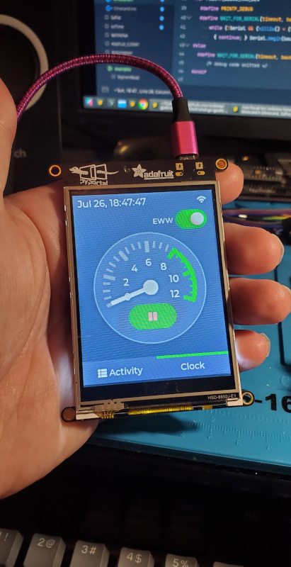
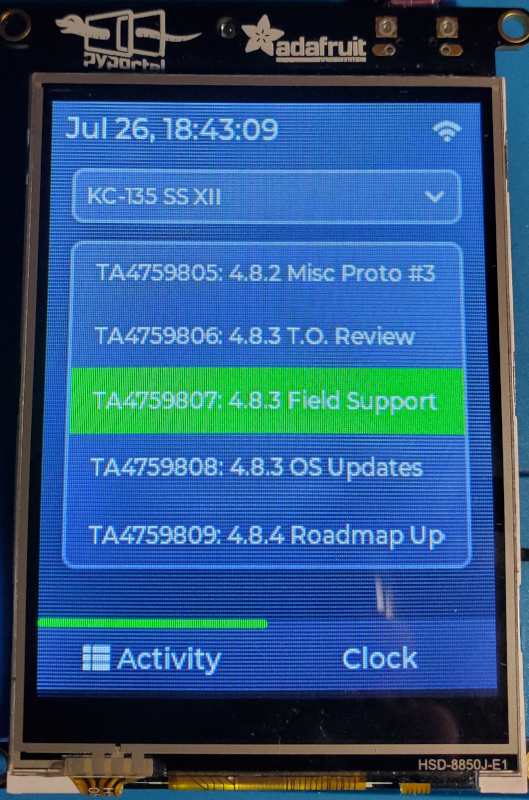
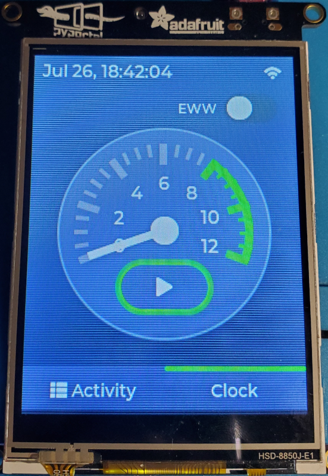

# timecard
Arduino application to track hours charged to projects while working from home

<p align="center">
  
</p>

## Description

If you're like me and put off filling your timecard until the end of the pay period, it can be a real pain trying to remember how many hours you worked for each task on each day. Also your boss hates you as a result.

This software lets you select a project and an associated activity, then you can start and stop a timer that tracks how many hours you worked on that activity.

Designed for the Adafruit PyPortal, it takes advantage of the ESP32 Wi-Fi module by automatically synchronizing local time with an NTP server. Additionally, time is tracked by logging to the internal SD card, making it easy to open and read from a PC when you actually submit your hours wherever.

## Format

Time is logged to the internal SD card every 6 minutes (every 1/10th of an hour), as long as the time tracker is not paused and the maximum hours per day has not been reached. Logging will resume once the time tracker is unpaused. The daily time counter is reset at 12:00AM local time. 

New log files are created for each day at filepath (relative to the root of the card) with format `/year/month/day.log`. For example, `/2020/07/28.log`.

Time logged to the SD card is never deleted or overwritten. The user must manually remove old log files to free available disk space.

Each log entry is a single line containing the following fields in the given order: RFC3339 datetime stamp, number of minutes (always 6), activity ID (charge code), project name, and activity description. Each field is delimited by a single tab `\t` character. The following is an example excerpt from a log file:

```
2020-07-26T18:49:57-05:00     6       TA4759807       KC-135 SS XII       4.8.3 Field Support
2020-07-26T18:55:57-05:00     6       TA4759807       KC-135 SS XII       4.8.3 Field Support
2020-07-26T19:01:57-05:00     6       TA4759807       KC-135 SS XII       4.8.3 Field Support
2020-07-26T19:07:57-05:00     6       TA4759807       KC-135 SS XII       4.8.3 Field Support
```

## Configuration

Apart from logging hours, the internal SD card also stores some configuration files needed for operation:

1. `/wifi.json` - defines recognized access points

Listed in decreasing priority, each AP will be attempted if the one listed before it could not be connected.

```json
{
  "ap": [
    {
      "ssid": "Work Wi-Fi",
      "pass": "secret"
    },
    {
      "ssid": "Home Wi-Fi",
      "pass": "password"
    }
  ]
}
```

2. `/projects.json` - defines available projects and their activities' charge codes and descriptions

The following example shows the required format.

```json
{
  "projects": [
    {
      "name": "My Project 1",
      "activities": [
        { "id": "Charge code 1", "description": "Blah blah" },
        { "id": "Charge code 2", "description": "Foo bar" },
        { "id": "Charge code 3", "description": "wat" },
      ]
    },
    {
      "name": "My Project 2",
      "activities": [
        { "id": "Charge code 1", "description": "Blah blah" },
        { "id": "Charge code 2", "description": "Foo bar" },
        { "id": "Charge code 3", "description": "wat" },
      ]
    }
  ]
}
```

## Screens

<p align="center">
  <table>
    <tr>
      <td></td>
      <td></td>
    </tr>
  </table>
</p>
